# LAPORAN PRAKTIKUM BAB 4

## Fondasi Teoretis dan Kerangka Kerja DevSecOps

**Nama**: Fitria Sari Ayuningtyas  
**NIM**: 3126640013  
**Kelas**: B D4 LJ Teknik Informatika  
**Tanggal pelaksanaan**: 4 Oktober 2026

## 1. Tujuan Praktikum

Praktikum Bab 4 bertujuan untuk memahami penerapan web service container menggunakan Apache, Nginx, dan Flask dalam lingkungan Docker. Praktikum ini mencakup pembuatan web server dengan konfigurasi custom, penerapan virtual host berbasis nama, penggunaan Nginx sebagai reverse proxy, serta penerapan TLS menggunakan sertifikat self-signed.

Selain itu, praktikum bertujuan untuk memahami penerapan keamanan pada web service container, khususnya pembatasan akses backend agar tidak langsung dipublikasikan ke host, penggunaan Docker network untuk komunikasi antar-container, pengamanan private key, penerapan security headers, healthcheck, serta pencatatan access log dan error log sebagai bukti operasional sistem.

### 2.1 Apache HTTP Server

Apache HTTP Server merupakan web server yang digunakan untuk menerima dan melayani permintaan HTTP dari client. Apache dapat digunakan untuk menyajikan halaman web statis maupun menjalankan aplikasi web melalui berbagai modul dan konfigurasi. Dalam praktikum ini, Apache digunakan sebagai web server backend yang melayani halaman HTML dan tidak diekspos secara langsung ke host.

### 2.2 Nginx

Nginx merupakan web server yang menggunakan pendekatan event-driven dalam menangani koneksi. Model ini memungkinkan worker process menangani banyak koneksi secara asynchronous sehingga Nginx sesuai digunakan untuk menangani koneksi client dalam jumlah besar. Pada praktikum ini, Nginx ditempatkan sebagai public boundary yang menerima koneksi HTTP/HTTPS dari host, menangani TLS, serta meneruskan request ke service backend.

### 2.3 Perbedaan Apache dan Web Server Event-Driven

Apache dan Nginx memiliki pendekatan yang berbeda dalam menangani koneksi client. Apache secara umum menggunakan model berbasis process atau thread melalui Multi-Processing Module (MPM), sedangkan Nginx menggunakan pendekatan event-driven dan asynchronous.

Pada Apache, setiap koneksi dapat ditangani menggunakan process atau thread sesuai MPM yang digunakan. Pendekatan ini fleksibel dan mendukung berbagai kebutuhan aplikasi web, tetapi penggunaan resource dapat meningkat ketika jumlah koneksi yang harus ditangani semakin banyak.

Sementara itu, Nginx menggunakan event loop sehingga satu worker dapat menangani banyak koneksi secara bersamaan tanpa membuat satu thread atau process untuk setiap koneksi. Oleh karena itu, Nginx banyak digunakan sebagai reverse proxy, load balancer, dan server yang menangani koneksi client.

Dalam praktikum ini kedua pendekatan tersebut digunakan secara bersamaan. Nginx berada di bagian depan sebagai reverse proxy dan terminasi TLS, sedangkan Apache digunakan sebagai web server backend. Dengan pembagian tersebut, client tidak perlu mengakses Apache secara langsung karena seluruh request masuk melalui Nginx.

### 2.4 Reverse Proxy

Reverse proxy merupakan server perantara yang menerima request dari client kemudian meneruskannya ke server backend. Pada praktikum ini, Nginx berfungsi sebagai reverse proxy yang meneruskan request berdasarkan path.

Request ke `/` diteruskan menuju Apache, sedangkan request ke `/api/` diteruskan menuju Flask. Dengan konfigurasi tersebut, backend dapat tetap berada di dalam Docker network dan tidak perlu membuka port secara langsung ke host.

### 2.5 TLS dan Private Key

Transport Layer Security (TLS) digunakan untuk memberikan enkripsi pada komunikasi antara client dan server. Pada praktikum ini digunakan sertifikat self-signed untuk kebutuhan pengujian lokal. Sertifikat dibuat menggunakan OpenSSL dengan nama `lab.crt`, sedangkan private key disimpan dalam file `lab.key`.

Private key merupakan komponen sensitif dalam mekanisme TLS sehingga harus diberikan permission yang ketat. Pada praktikum, permission private key diatur menjadi `600`, sehingga hanya owner yang memiliki hak baca dan tulis terhadap file tersebut. File sertifikat dan private key kemudian di-mount ke container Nginx dalam mode read-only.

Penyimpanan tersebut mengurangi risiko perubahan atau modifikasi private key oleh proses di dalam container.

### 2.6 Peta Konsep Penyimpanan Private Key

Penyimpanan private key pada praktikum menerapkan prinsip least privilege dan read-only mount. Private key dibuat dan disimpan pada host, kemudian digunakan oleh Nginx melalui volume mount dengan mode read-only.

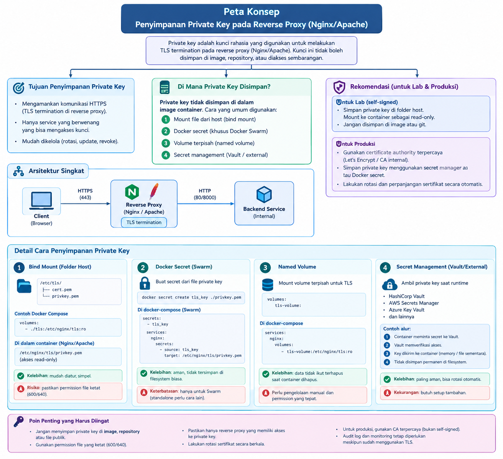

**Gambar 1. Peta konsep penyimpanan dan penggunaan private key TLS.**

## 3. Alat dan Lingkungan

Praktikum dilakukan menggunakan lingkungan WSL2 Ubuntu dengan Docker sebagai platform containerization. Adapun alat dan lingkungan yang digunakan adalah sebagai berikut.

| No. | Alat/Lingkungan | Keterangan |
|---|---|---|
| 1 | WSL2 Ubuntu | Lingkungan Linux untuk menjalankan praktikum |
| 2 | Docker Engine | 29.7.2 |
| 3 | Docker Compose | 5.5.0 |
| 4 | OpenSSL | 3.5.5 |
| 5 | cURL | 8.18.0 |
| 6 | Nginx | nginx:alpine |
| 7 | Apache | httpd:2.4-alpine |
| 8 | Python | 3.12-slim pada container Flask |
| 9 | Flask | 3.1.2 |
| 10 | Gunicorn | 23.0.0 |

## 4. Langkah Praktikum

### 4.1 Persiapan Struktur Project

Tahap pertama dilakukan dengan membuat struktur direktori untuk menyimpan konfigurasi Docker Compose, konfigurasi Nginx dan Apache, aplikasi Flask, sertifikat TLS, serta log Nginx.

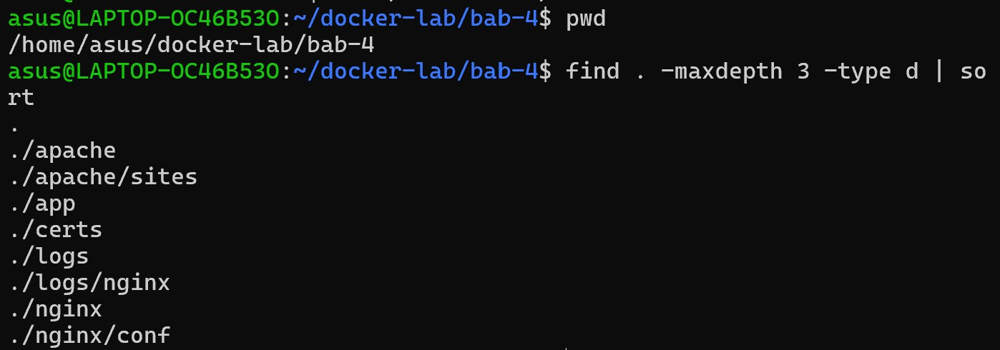

**Gambar 2. Struktur direktori project Docker Lab Bab 4.**

### 4.2 Pembuatan Sertifikat TLS

Sertifikat TLS self-signed dibuat menggunakan OpenSSL. Sertifikat digunakan oleh Nginx untuk menyediakan layanan HTTPS pada port 443 yang dipublikasikan ke host melalui port 8443.

Private key diberikan permission `600`, sedangkan sertifikat diberikan permission `644`.

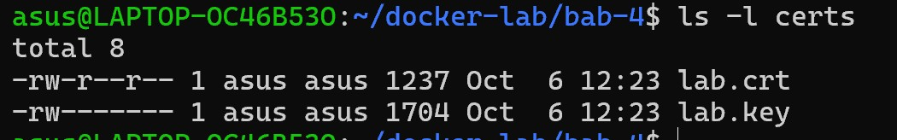

**Gambar 3. Sertifikat TLS dan permission private key.**

### 4.3 Validasi Docker Compose

Konfigurasi Docker Compose divalidasi sebelum container dijalankan. Validasi dilakukan untuk memastikan struktur konfigurasi dapat diproses oleh Docker Compose dan service yang didefinisikan terdiri dari `proxy`, `apache-web`, dan `flask-app`.

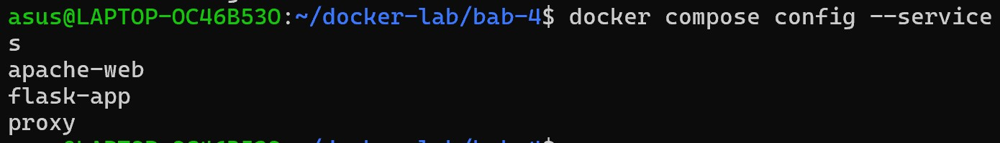

**Gambar 4. Hasil validasi konfigurasi Docker Compose.**

### 4.4 Menjalankan Container

Container dijalankan menggunakan Docker Compose dengan proses build pada aplikasi Flask. Hasil pemeriksaan menunjukkan bahwa ketiga service berhasil berjalan. Service Flask berada pada status `healthy`, sedangkan hanya Nginx yang memiliki published port ke host, yaitu port 8080 dan 8443.

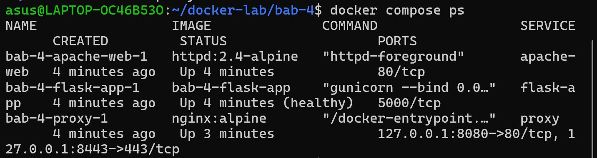

**Gambar 5. Status container setelah Docker Compose dijalankan.**

### 4.5 Pengujian HTTP Redirect ke HTTPS

Pengujian pertama dilakukan dengan mengakses Nginx melalui HTTP pada port `8080`. Berdasarkan hasil pengujian, Nginx memberikan response `301 Moved Permanently` dan mengarahkan request menuju HTTPS pada port `8443`.

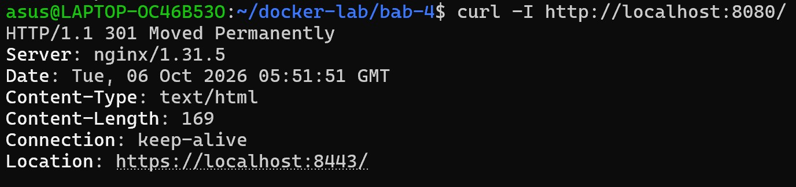

**Gambar 6. Pengujian redirect HTTP ke HTTPS.**

### 4.6 Pengujian HTTPS dan Reverse Proxy ke Apache

Setelah memastikan HTTP diarahkan ke HTTPS, dilakukan pengujian menggunakan HTTPS pada port `8443`. Request ke path `/` diteruskan oleh Nginx menuju service Apache melalui Docker network.

Hasil pengujian menunjukkan response `200 OK` dan halaman HTML dari Apache berhasil ditampilkan. Response juga menunjukkan security headers seperti `X-Content-Type-Options`, `X-Frame-Options`, dan `Referrer-Policy` yang dikonfigurasi pada Nginx.

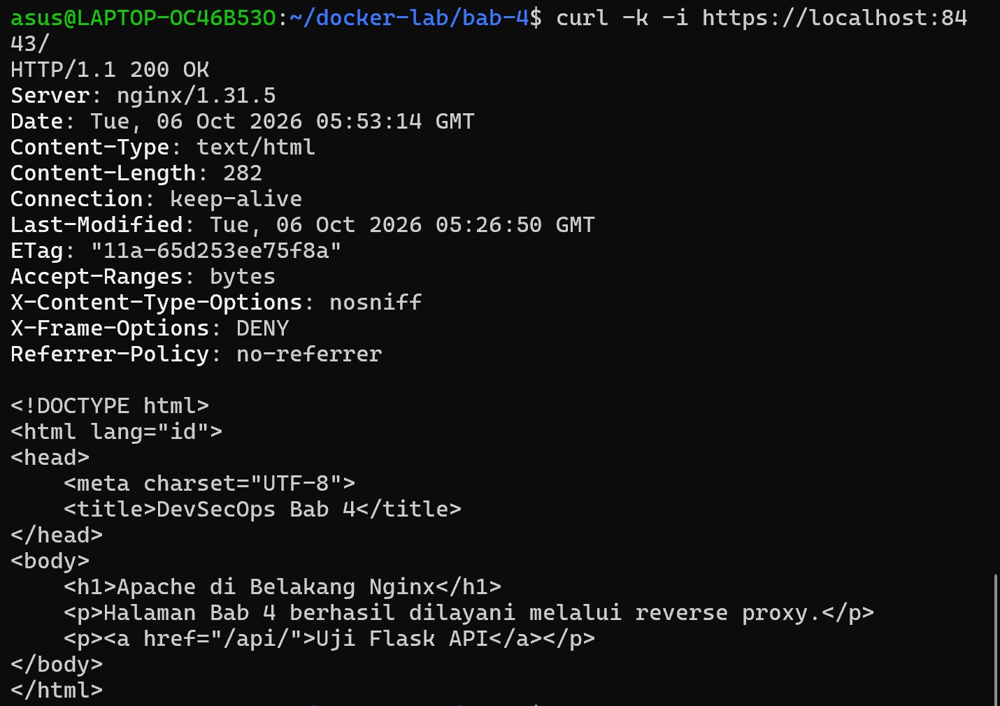

**Gambar 7. Pengujian HTTPS dan reverse proxy menuju Apache.**

### 4.7 Pengujian Flask API melalui Reverse Proxy

Pengujian selanjutnya dilakukan terhadap endpoint `/api/`. Nginx meneruskan request tersebut menuju service Flask pada port `5000` melalui Docker network.

Hasil pengujian menunjukkan response `200 OK` dengan format JSON. Field `forwarded_proto` bernilai `https`, sehingga dapat diketahui bahwa Nginx meneruskan informasi protokol kepada backend melalui header `X-Forwarded-Proto`.

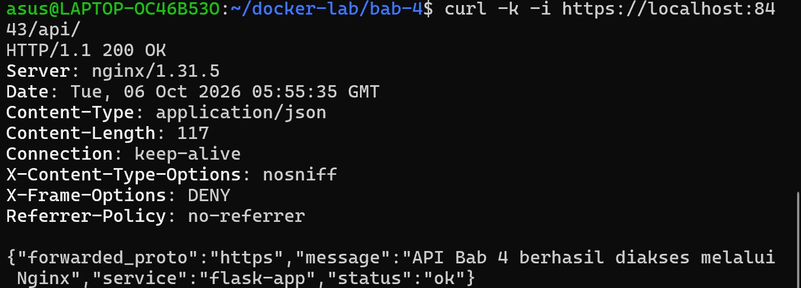

**Gambar 8. Pengujian Flask API melalui reverse proxy Nginx.**

### 4.8 Pengujian Healthcheck Flask

Endpoint `/api/health` digunakan untuk memastikan service Flask dalam kondisi sehat dan dapat menerima request melalui Nginx. Hasil pengujian menunjukkan response `200 OK` dengan status `healthy`.

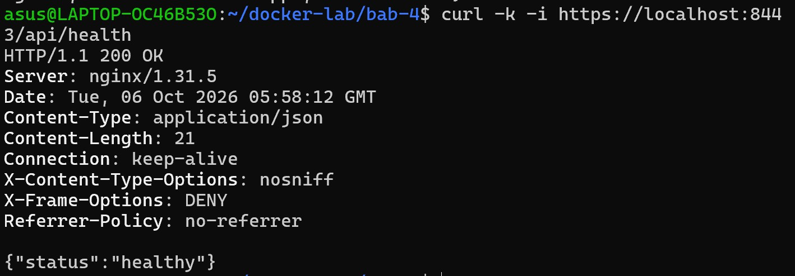

**Gambar 9. Pengujian endpoint healthcheck Flask.**

### 4.9 Pengujian TLS Handshake

Pengujian TLS dilakukan menggunakan OpenSSL dengan menghubungkan client ke Nginx melalui port `8443`. Hasil pengujian menunjukkan bahwa koneksi berhasil dibuat menggunakan TLS versi 1.3 dengan cipher `TLS_AES_256_GCM_SHA384`.

OpenSSL memberikan informasi `self-signed certificate` karena sertifikat yang digunakan dibuat sendiri untuk kebutuhan praktikum dan belum ditandatangani oleh Certificate Authority (CA) publik. Meskipun demikian, proses TLS handshake berhasil dilakukan.

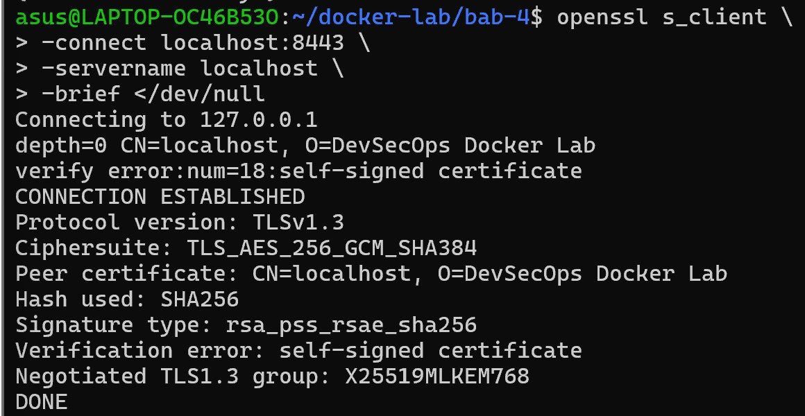

**Gambar 10. Hasil pengujian TLS handshake menggunakan OpenSSL.**

## 5. Hasil Pengujian

### 5.1 Pemeriksaan Docker Network

Pemeriksaan Docker network dilakukan untuk melihat container yang terhubung pada network `bab-4_web-net`. Hasil pemeriksaan menunjukkan bahwa service `proxy`, `apache-web`, dan `flask-app` berada pada network bridge yang sama dengan alamat IP internal masing-masing.

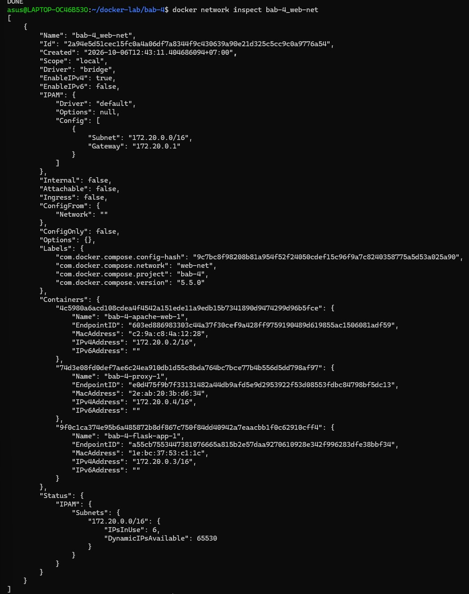

**Gambar 11. Container yang terhubung pada Docker network `web-net`.**

### 5.2 Pengujian Komunikasi Internal Antar-Container

Pengujian komunikasi internal dilakukan dari container Nginx menuju service Apache dan Flask. Nginx berhasil mengakses Apache menggunakan service name `apache-web` dan mengakses endpoint health Flask menggunakan service name `flask-app`.

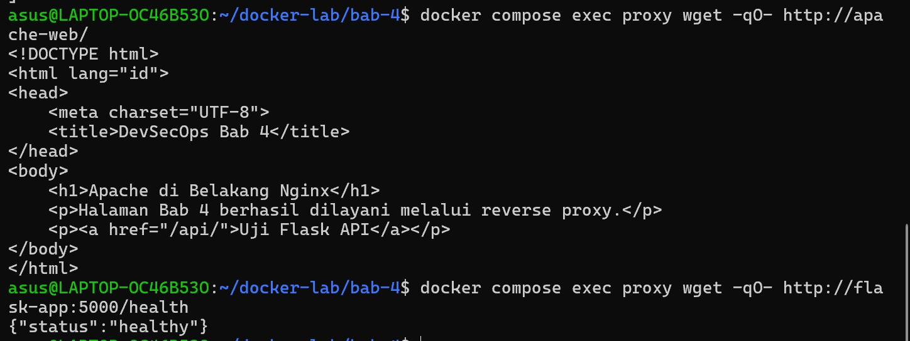

**Gambar 12. Pengujian komunikasi internal dari Nginx menuju Apache dan Flask.**

### 5.3 Pemeriksaan Access Log Nginx

Pemeriksaan access log dilakukan untuk memastikan request yang telah diuji tercatat pada Nginx. Log menunjukkan request HTTP yang menghasilkan status `301` serta request HTTPS ke halaman utama, API, dan healthcheck yang menghasilkan status `200`.

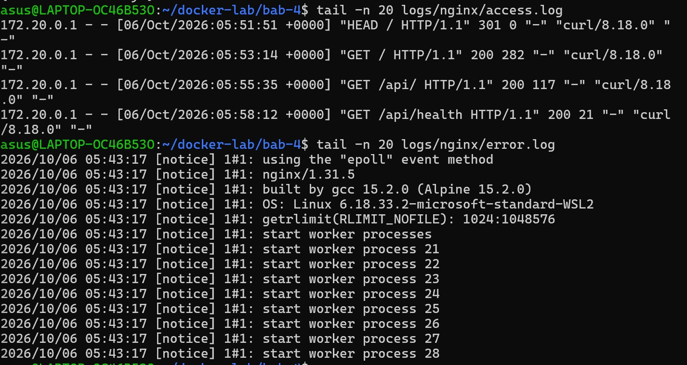

**Gambar 13. Access log Nginx dari hasil pengujian layanan.**

## 6. Threat Statement

Beberapa risiko keamanan yang perlu diperhatikan pada arsitektur web service container ini adalah akses langsung terhadap backend, kebocoran private key TLS, komunikasi tanpa enkripsi, serta penyalahgunaan header yang diteruskan oleh reverse proxy.

Pada praktikum, risiko akses langsung terhadap backend dikurangi dengan tidak melakukan publish port Apache dan Flask ke host. Client hanya mengakses service melalui Nginx sebagai public boundary. Private key TLS juga diberikan permission `600` dan di-mount ke container Nginx dalam mode read-only.

Selain itu, penggunaan TLS pada Nginx melindungi komunikasi client menuju reverse proxy, sedangkan security headers seperti `X-Content-Type-Options`, `X-Frame-Options`, dan `Referrer-Policy` digunakan untuk mengurangi beberapa risiko pada sisi HTTP.

## 7. Analisis

Selama proses menjalankan container, terdapat pesan pada log Nginx berupa `can not modify /etc/nginx/conf.d/default.conf (read-only file system?)`. Pesan tersebut muncul karena direktori konfigurasi Nginx pada host di-mount ke container menggunakan mode read-only (`:ro`). Entrypoint image Nginx mencoba melakukan modifikasi terhadap file konfigurasi default, tetapi operasi tersebut ditolak karena filesystem di dalam container bersifat read-only untuk volume tersebut.

Pesan tersebut tidak menyebabkan service gagal berjalan. Hal ini dibuktikan dengan status container Nginx yang tetap `Up`, pengujian HTTPS menghasilkan response `200 OK`, serta TLS handshake berhasil menggunakan TLS 1.3. Dengan demikian, pesan tersebut merupakan konsekuensi dari konfigurasi keamanan yang digunakan dan bukan kegagalan layanan.

Penggunaan mount read-only justru memberikan keuntungan keamanan karena konfigurasi dan private key yang diberikan kepada container tidak dapat dimodifikasi oleh proses di dalam container. Namun, pada lingkungan produksi konfigurasi image dan volume sebaiknya disesuaikan agar proses startup tidak menghasilkan warning yang tidak diperlukan.

Selain itu, Apache menghasilkan warning mengenai fully qualified domain name ketika container dijalankan. Warning tersebut tidak mengganggu penyajian halaman karena Apache tetap berhasil melayani request melalui Nginx. Untuk lingkungan produksi, konfigurasi `ServerName` dapat ditentukan secara eksplisit agar warning tersebut tidak muncul.

## 8. Tindak Lanjut

Berdasarkan hasil praktikum dan analisis yang dilakukan, beberapa tindak lanjut yang dapat diterapkan untuk meningkatkan keamanan dan kesiapan sistem adalah sebagai berikut.

1. **Menggunakan sertifikat dari Certificate Authority (CA) terpercaya**  
   Sertifikat self-signed digunakan untuk kebutuhan praktikum. Pada lingkungan produksi, sertifikat sebaiknya menggunakan CA terpercaya agar client dapat memverifikasi identitas server tanpa peringatan sertifikat.

2. **Menjaga private key dengan permission dan penyimpanan yang aman**  
   Private key perlu tetap menggunakan permission yang ketat dan tidak disimpan pada repository. Pada lingkungan produksi, pengelolaan secret dapat menggunakan secret manager atau mekanisme penyimpanan secret yang sesuai.

3. **Mempertahankan backend agar tidak dipublish langsung ke host**  
   Apache dan Flask sebaiknya tetap berada di jaringan internal dan hanya dapat diakses melalui reverse proxy. Hal ini mengurangi attack surface karena backend tidak langsung tersedia dari luar.

4. **Menerapkan TLS secara konsisten**  
   Konfigurasi TLS perlu mempertahankan penggunaan protokol yang aman seperti TLS 1.2 dan TLS 1.3 serta menonaktifkan protokol lama yang sudah tidak direkomendasikan.

5. **Menerapkan log rotation dan monitoring**  
   Access log dan error log perlu dikelola menggunakan mekanisme rotasi dan monitoring agar ukuran log tidak terus bertambah dan kejadian keamanan dapat dideteksi lebih cepat.

6. **Menambahkan konfigurasi readiness dan health monitoring**  
   Healthcheck Flask sudah diterapkan pada praktikum. Pada sistem produksi, mekanisme healthcheck dapat dikembangkan menjadi readiness dan liveness check untuk memastikan service benar-benar siap menerima traffic.

## 9. Kesimpulan

Praktikum Bab 4 berhasil menerapkan web service container menggunakan Docker Compose dengan Nginx sebagai public boundary dan reverse proxy, Apache sebagai web server backend, serta Flask sebagai service API. Seluruh service berhasil berjalan pada Docker network yang sama dan backend tidak dipublikasikan secara langsung ke host.

Hasil pengujian menunjukkan bahwa request HTTP berhasil diarahkan ke HTTPS, koneksi TLS berhasil menggunakan TLS 1.3, halaman Apache dapat diakses melalui reverse proxy, serta API Flask dan endpoint healthcheck dapat diakses melalui Nginx. Komunikasi internal antar-container juga berhasil dilakukan menggunakan service name Docker.

Dari sisi keamanan, praktikum telah menerapkan pembatasan published port, permission private key, read-only volume mount, TLS, security headers, healthcheck, dan pencatatan access log. Dengan demikian, arsitektur yang dibuat telah menunjukkan penerapan dasar keamanan dan operasional web service container yang dapat dikembangkan lebih lanjut untuk lingkungan produksi.

## 10. Evaluasi dan Latihan Mandiri

### 1. Mengapa reverse proxy tidak seharusnya menjalankan semua logic aplikasi?

Reverse proxy sebaiknya berfokus pada fungsi yang berkaitan dengan traffic seperti menerima koneksi client, terminasi TLS, routing request, load balancing, dan penerapan security header. Logic aplikasi sebaiknya tetap berada pada service backend seperti Apache atau Flask. Pemisahan ini membuat arsitektur lebih terstruktur, mudah dikembangkan, dan mengurangi beban pada reverse proxy.

### 2. Apa perbedaan TLS termination dan end-to-end TLS?

TLS termination adalah kondisi ketika koneksi TLS dari client berakhir pada reverse proxy. Setelah request diterima dan didekripsi oleh reverse proxy, request dapat diteruskan ke backend menggunakan HTTP atau koneksi lain di dalam jaringan.

Sedangkan end-to-end TLS mempertahankan enkripsi TLS sampai ke backend. Dengan demikian, komunikasi antara reverse proxy dan backend juga tetap terenkripsi. Pada praktikum ini digunakan TLS termination pada Nginx karena sertifikat TLS dikonfigurasi pada service proxy.

### 3. Bagaimana cara mengisolasi backend agar tidak langsung diakses dari host?

Backend dapat diisolasi dengan menempatkan service pada Docker network dan tidak memberikan konfigurasi `ports` pada service backend. Hanya reverse proxy yang memiliki published port ke host. Pada praktikum, Apache dan Flask tidak memiliki published port sehingga client mengakses keduanya melalui Nginx.

### 4. Apa konsekuensi menyimpan private key TLS di bind mount?

Private key yang disimpan pada bind mount berada pada filesystem host sehingga keamanan file tersebut bergantung pada permission dan keamanan host. Jika private key dapat dibaca oleh pengguna atau proses yang tidak berwenang, penyerang dapat menggunakannya untuk menyamar sebagai server. Oleh karena itu, private key harus diberikan permission yang ketat, tidak dimasukkan ke repository, dan sebaiknya menggunakan secret management pada lingkungan produksi.

### 5. Bandingkan log Nginx dan log Apache dari sisi format dan kegunaan debugging.

Log Nginx pada praktikum mencatat request client pada access log dengan informasi seperti alamat IP, waktu request, HTTP method, URI, status response, ukuran response, dan user agent. Log tersebut berguna untuk melihat traffic yang masuk dan memastikan request berhasil diteruskan oleh reverse proxy.

Apache juga memiliki access log dan error log yang digunakan untuk melihat request yang diterima serta masalah yang terjadi pada web server. Perbedaannya terletak pada posisi dan konteks penggunaannya. Log Nginx lebih berguna untuk menganalisis traffic pada public boundary dan proses reverse proxy, sedangkan log Apache lebih berguna untuk menganalisis request yang sudah diterima oleh backend web server.

Dengan demikian, kedua log dapat digunakan secara bersamaan untuk melakukan tracing request dari client, melalui Nginx, hingga ke backend.

## 11. Referensi

1. Docker Documentation. *Docker Compose Documentation*.
2. Nginx Documentation. *NGINX Reverse Proxy*.
3. Apache HTTP Server Documentation. *Apache HTTP Server Documentation*.
4. OpenSSL Documentation. *OpenSSL Documentation*.
5. Flask Documentation. *Flask Documentation*.
6. Materi Praktikum DevSecOps Bab 4 — *Web Service Container: Apache, Nginx, Reverse Proxy, dan TLS*.

