# LAPORAN PRAKTIKUM BAB 5

## Database Service di Docker: PostgreSQL

**Nama**: Fitria Sari Ayuningtyas  
**NIM**: 3126640013  
**Kelas**: B D4 LJ Teknik Informatika  
**Tanggal pelaksanaan**: 9 Oktober 2026

## 1. Tujuan Praktikum

Praktikum ini bertujuan untuk mempelajari cara menjalankan PostgreSQL menggunakan Docker Compose. Praktikum ini juga dilakukan untuk memahami cara membuat tabel dan memasukkan data awal secara otomatis, mengakses database melalui terminal dan pgAdmin, serta menyimpan data menggunakan Docker volume.

Selain itu, praktikum ini mencakup pengelolaan password database menggunakan Docker secrets, pembuatan backup menggunakan `pg_dump`, dan pemulihan database menggunakan `pg_restore`. Melalui pengujian tersebut, dapat diketahui apakah layanan database berjalan dengan baik dan apakah data yang telah dicadangkan dapat dipulihkan kembali.

## 2. Dasar Teori

  ### 2.1 PostgreSQL
  
  PostgreSQL merupakan sistem manajemen basis data relasional yang digunakan untuk menyimpan dan mengelola data. Pada praktikum ini, PostgreSQL digunakan untuk menyimpan data mahasiswa dalam tabel `students`. Data tersebut kemudian diperiksa menggunakan perintah SQL melalui terminal dan pgAdmin.
  
  ### 2.2 Docker Compose
  
  Docker Compose digunakan untuk mengatur beberapa layanan container melalui satu file konfigurasi. Pada praktikum ini, Docker Compose digunakan untuk menjalankan PostgreSQL dan pgAdmin, mengatur jaringan komunikasi antarlayanan, menentukan volume penyimpanan, serta mengatur ketergantungan antara kedua layanan.
  
  ### 2.3 Docker Volume
  
  Docker volume digunakan untuk menyimpan data di luar siklus hidup container. Dengan volume, data PostgreSQL dapat tetap tersedia ketika container dihentikan atau dibuat ulang, selama volume yang menyimpan data tersebut tidak dihapus.
  
  ### 2.4 Docker Secrets
  
  Docker secrets digunakan untuk menyediakan informasi sensitif, seperti password database, kepada layanan yang membutuhkannya. Pada praktikum ini, password PostgreSQL disimpan dalam file terpisah dan diberikan kepada container melalui `/run/secrets/postgres_password`. Dengan cara ini, password PostgreSQL tidak perlu ditulis langsung sebagai nilai `POSTGRES_PASSWORD` di file Compose.
  
  Penggunaan secrets melalui file pada Docker Compose lokal membantu memisahkan password dari konfigurasi layanan. Namun, file rahasia tetap perlu dilindungi menggunakan pengaturan izin akses yang sesuai dan tidak boleh ikut diunggah ke repository publik.
  
  ### 2.5 Backup dan Restore Database
  
  Backup merupakan proses membuat salinan data database agar dapat digunakan kembali apabila terjadi kehilangan atau kerusakan data. Pada praktikum ini, backup dilakukan menggunakan `pg_dump` dengan format custom. File backup kemudian diperiksa menggunakan checksum SHA-256.
  
  Restore merupakan proses mengembalikan data dari file backup ke database. Pada praktikum ini, proses restore dilakukan menggunakan `pg_restore` pada database pengujian terpisah. Cara tersebut digunakan untuk memeriksa apakah data dapat dipulihkan tanpa mengubah database utama.

## 3. Alat dan Bahan

Alat dan bahan yang digunakan dalam praktikum ini ditunjukkan pada tabel berikut.

| No. | Alat/Bahan | Keterangan |
|---|---|---|
| 1 | Ubuntu 26.04 LTS pada WSL2 | Lingkungan untuk menjalankan praktikum. |
| 2 | Docker Engine Community 29.7.2 | Menjalankan layanan dalam container. |
| 3 | Docker Compose 5.5.0 | Mengatur konfigurasi dan menjalankan beberapa layanan container. |
| 4 | PostgreSQL 16 (`postgres:16-alpine`) | Layanan database untuk menyimpan data mahasiswa. |
| 5 | pgAdmin (`dpage/pgadmin4`) | Antarmuka berbasis web untuk mengakses dan mengelola database. |
| 6 | File `compose.yaml` | Konfigurasi layanan, jaringan, volume, dan secrets. |
| 7 | File `init/01-schema.sql` | Membuat tabel `students`, memasukkan data awal, dan membuat indeks. |
| 8 | File `secrets/postgres_password.txt` | Menyimpan password PostgreSQL untuk digunakan sebagai Docker secret. |
| 9 | File `scripts/backup.sh` | Menjalankan backup database dan membuat checksum SHA-256. |
| 10 | Terminal dan browser | Menjalankan perintah Docker serta mengakses pgAdmin. |

## 4. Langkah-Langkah Praktikum

## 4.1 Pemeriksaan Layanan Docker

Tahap awal praktikum dilakukan dengan memeriksa layanan PostgreSQL dan pgAdmin yang dijalankan menggunakan Docker Compose. Pemeriksaan dilakukan untuk memastikan kedua container telah berjalan sesuai konfigurasi sebelum pengujian database dilakukan.

Perintah berikut digunakan untuk melihat status container:

```bash
docker compose ps
```

Berdasarkan hasil pemeriksaan, container PostgreSQL berada dalam status `healthy`, sedangkan container pgAdmin berada dalam status `Up`. Status tersebut menunjukkan bahwa kedua layanan telah berjalan dan PostgreSQL berhasil melewati pemeriksaan kesehatan container.

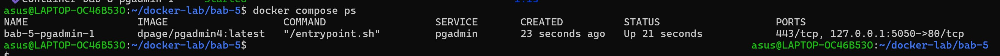
**Gambar 1. Status container PostgreSQL dan pgAdmin.**


## 4.2 Pemeriksaan Log PostgreSQL

Setelah memastikan container berjalan, dilakukan pemeriksaan log PostgreSQL untuk mengetahui apakah proses inisialisasi database berhasil dijalankan. Pemeriksaan dilakukan menggunakan perintah berikut:

```bash
docker compose logs postgres-db
```

Berdasarkan hasil pemeriksaan, PostgreSQL berhasil menjalankan proses inisialisasi database dan menyelesaikan proses startup. Log menunjukkan bahwa server telah siap menerima koneksi sehingga database dapat digunakan untuk pengujian selanjutnya.

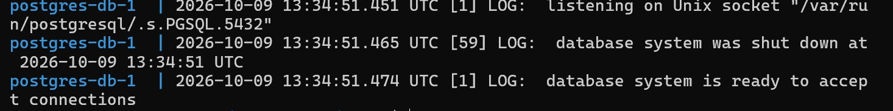
**Gambar 2. Hasil pemeriksaan log PostgreSQL.**

## 4.3 Akses pgAdmin melalui Browser

Pengujian selanjutnya dilakukan dengan mengakses pgAdmin melalui browser pada alamat `http://localhost:5050`. pgAdmin digunakan untuk mempermudah pengelolaan database melalui antarmuka grafis tanpa harus selalu menjalankan perintah SQL melalui terminal.

Setelah berhasil login, halaman utama pgAdmin ditampilkan. Server PostgreSQL yang digunakan pada praktikum ini terhubung melalui hostname `postgres-db` dan port `5432`. Hostname tersebut dapat digunakan karena kedua layanan berada pada jaringan internal Docker yang sama.

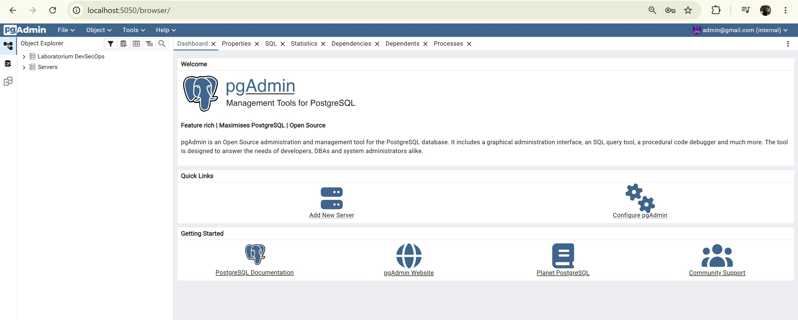
**Gambar 3. Tampilan dashboard pgAdmin.**

## 4.4 Pengujian Data Mahasiswa melalui Terminal

Pengujian berikutnya dilakukan dengan menjalankan query SQL untuk menampilkan data mahasiswa yang tersimpan pada database `labdb`. Perintah berikut dijalankan melalui terminal:

```bash
docker compose exec postgres-db psql -U labuser -d labdb -c "SELECT id, nrp, name FROM students ORDER BY id;"
```

Perintah tersebut menjalankan `psql` di dalam container PostgreSQL dan menampilkan kolom `id`, `nrp`, serta `name` dari tabel `students`. Data diurutkan berdasarkan `id` agar hasilnya ditampilkan secara berurutan.

Berdasarkan hasil pengujian, terdapat tiga data mahasiswa yang berhasil ditampilkan. Dua data pertama berasal dari proses inisialisasi database, sedangkan data ketiga, yaitu Mahasiswa Uji, ditambahkan saat pengujian berlangsung.

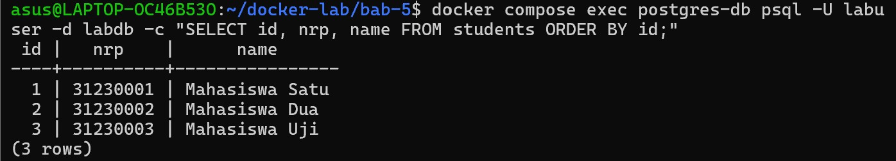
**Gambar 4. Hasil query data mahasiswa melalui terminal.**

## 4.5 Pengujian Data Mahasiswa melalui pgAdmin

Setelah pengujian melalui terminal berhasil dilakukan, pengujian dilanjutkan melalui pgAdmin untuk memastikan data mahasiswa dapat diakses melalui antarmuka berbasis web. pgAdmin dibuka melalui browser pada alamat `http://localhost:5050`.

Setelah masuk ke pgAdmin, database `labdb` dipilih dan query dijalankan untuk menampilkan isi tabel `students`. Hasil pengujian menunjukkan tiga data mahasiswa yang sama dengan hasil query melalui terminal, yaitu Mahasiswa Satu, Mahasiswa Dua, dan Mahasiswa Uji.

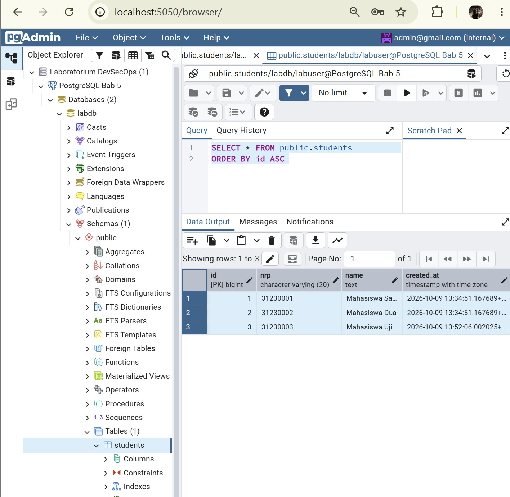
**Gambar 5. Hasil query data mahasiswa melalui pgAdmin.**

## 4.6 Pemeriksaan Publikasi Port PostgreSQL

Pemeriksaan port dilakukan untuk memastikan PostgreSQL tidak dipublikasikan secara langsung ke host. Pemeriksaan ini penting karena layanan database sebaiknya hanya dapat diakses oleh layanan yang memang membutuhkan koneksi, sesuai dengan konfigurasi jaringan yang digunakan.

Pemeriksaan dilakukan menggunakan perintah berikut:

```bash
docker inspect bab-5-postgres-db-1 --format '{{json .NetworkSettings.Ports}}'
```

Berdasarkan hasil pemeriksaan, port `5432/tcp` tidak memiliki pemetaan port ke host. Artinya, PostgreSQL tidak dipublikasikan melalui port host, sedangkan pgAdmin tetap dapat mengaksesnya melalui jaringan internal Docker.

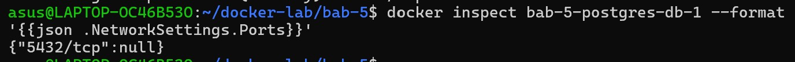
**Gambar 6. Hasil pemeriksaan publikasi port PostgreSQL.**

## 4.7 Pengamanan Password dan Pemeriksaan `.gitignore`

Password PostgreSQL disimpan dalam file `secrets/postgres_password.txt` dan diberikan kepada container melalui Docker secret. File tersebut memiliki permission `600`, sehingga hanya pemilik file yang memiliki izin baca dan tulis.

Untuk mencegah file rahasia ikut dimasukkan ke repository Git, folder `secrets/` ditambahkan ke file `.gitignore`. Pemeriksaan dilakukan menggunakan perintah berikut:

```bash
ls -l secrets/postgres_password.txt
git check-ignore -v secrets/postgres_password.txt
```

Hasil pemeriksaan menunjukkan bahwa file password memiliki permission terbatas dan cocok dengan aturan `secrets/` pada `.gitignore`. Dengan demikian, file password diabaikan oleh Git sesuai dengan konfigurasi yang dibuat.

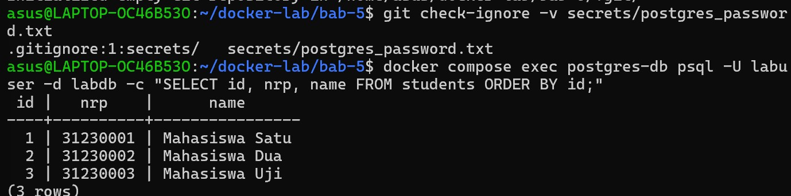
**Gambar 7. Pemeriksaan permission file password dan aturan `.gitignore`.**

## 4.8 Pengujian Backup Database

Pengujian backup dilakukan untuk memastikan database PostgreSQL dapat dicadangkan ke dalam sebuah file. Proses backup dijalankan menggunakan script `backup.sh` yang memanfaatkan perintah `pg_dump` dengan format custom (`-Fc`). Setelah file backup dibuat, script juga menghasilkan checksum SHA-256 untuk membantu memeriksa integritas file.

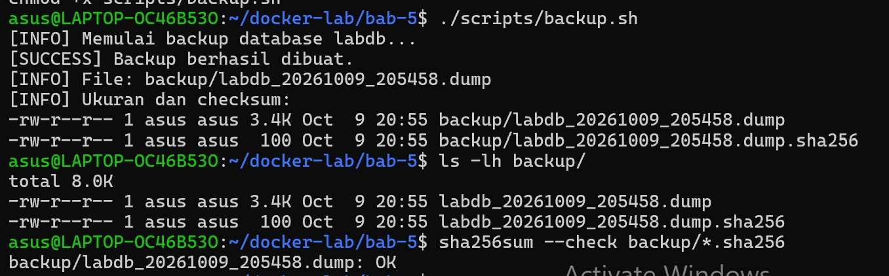
**Gambar 8. Hasil Pengujian Backup Database PostgreSQL**

## 4.9 Pemeriksaan Isi File Backup

Setelah proses backup selesai, dilakukan pemeriksaan terhadap isi file backup menggunakan perintah `pg_restore --list`. Perintah ini digunakan untuk menampilkan daftar objek database yang tersimpan dalam file backup tanpa melakukan proses pemulihan data.

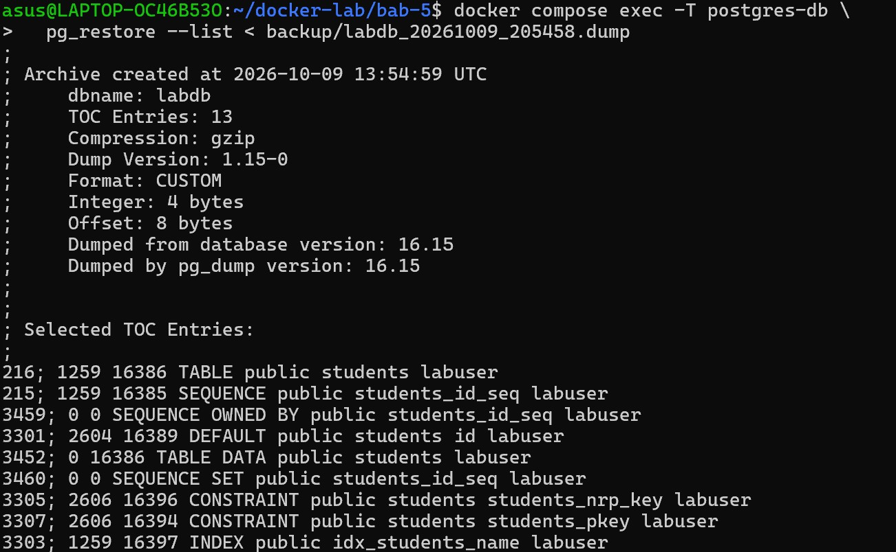
**Gambar 8. Pemeriksaan Isi File Backup PostgreSQL**

## 4.10 Pengujian Pemulihan Database (Restore)

Pengujian restore dilakukan untuk memastikan file backup dapat digunakan untuk memulihkan database. Agar database utama tetap aman, pemulihan dilakukan ke database terpisah bernama `labdb_restore`. Dengan cara ini, hasil pemulihan dapat diperiksa tanpa mengubah database utama `labdb`.

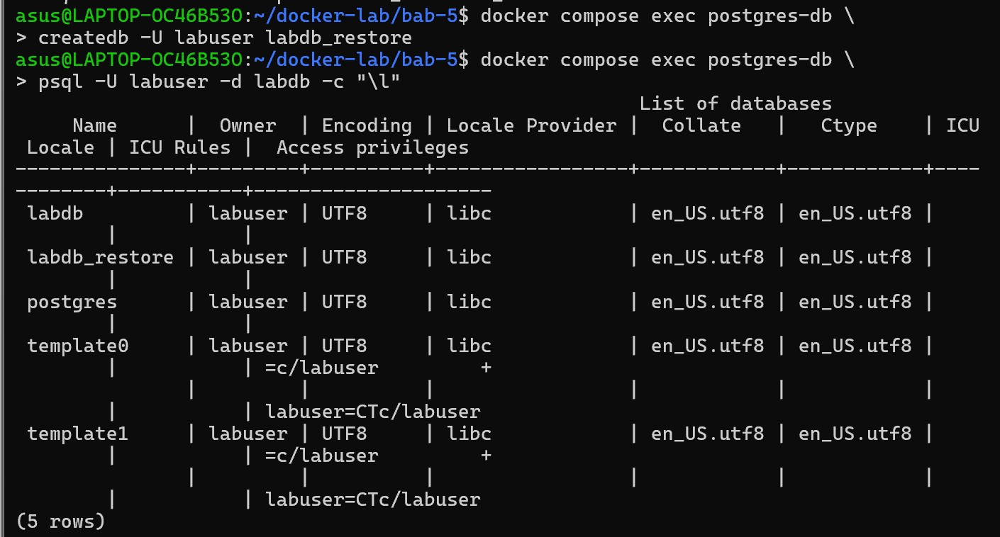
**Gambar 9. Daftar Database PostgreSQL untuk Pengujian Restore**

Pemulihan dilakukan menggunakan perintah berikut:

```bash
docker compose exec -T postgres-db \
  pg_restore -U labuser -d labdb_restore \
  --no-owner --no-privileges \
  < backup/labdb_20261009_205458.dump
```

Perintah tersebut membaca file backup dan memulihkan objek beserta data ke database `labdb_restore`. Opsi `--no-owner` dan `--no-privileges` digunakan agar informasi kepemilikan objek dan hak akses dari database asal tidak diterapkan saat pemulihan.

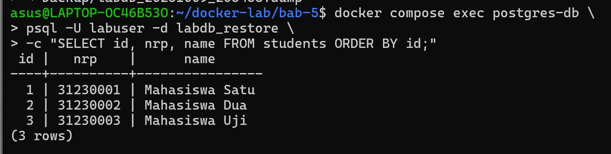
**Gambar 10. Hasil Pengujian Restore Database PostgreSQL**

Hasil yang dibuktikan:
- Database `labdb_restore` berhasil dibuat.
- File backup berhasil dipulihkan ke database tujuan.
- Data hasil pemulihan berjumlah tiga baris dan sesuai dengan data pada database utama.
- Database utama `labdb` tetap dapat digunakan setelah pengujian restore.
