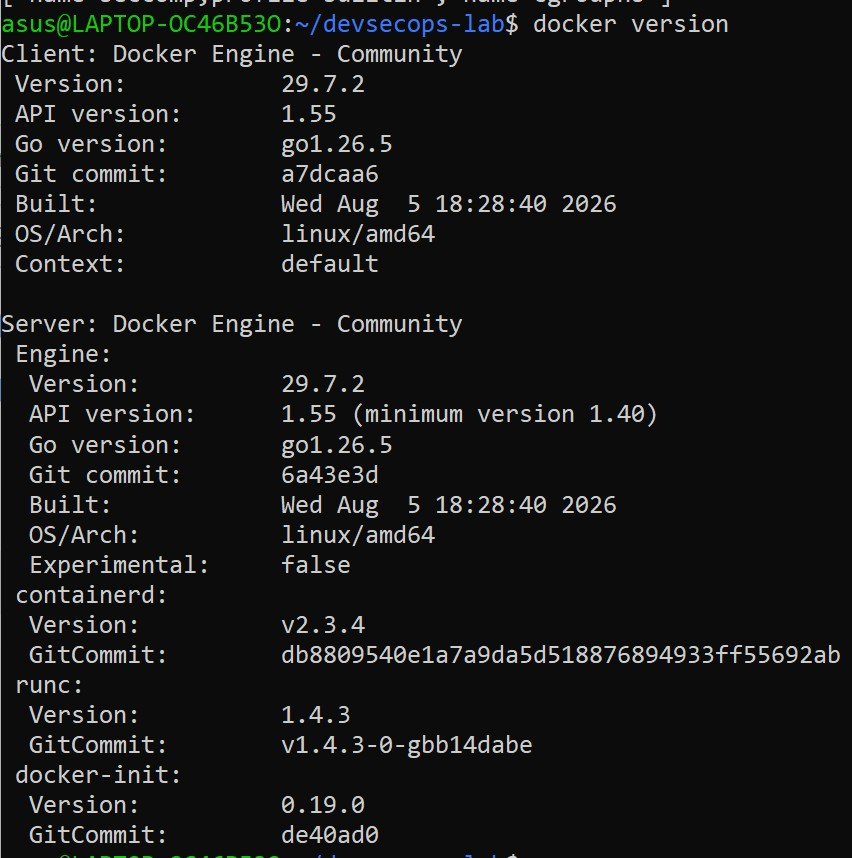
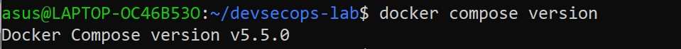
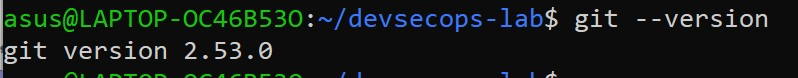
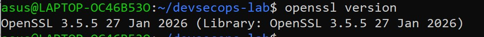
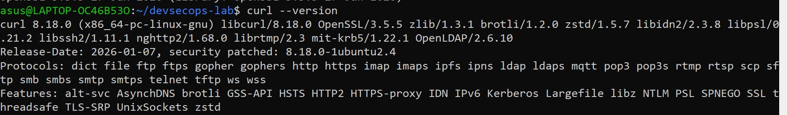
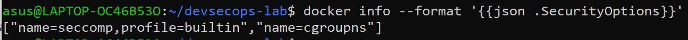
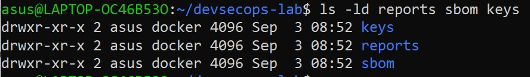

# LAPORAN PRAKTIKUM BAB 1

## Fondasi Teoretis dan Kerangka Kerja DevSecOps

**Nama**: Fitria Sari Ayuningtyas  
**NIM**: 3126640013  
**Kelas**: D4 LJ Teknik Informatika  
**Tanggal pelaksanaan**: 15 September 2026

## 1. Tujuan Praktikum

Praktikum Bab 1 bertujuan untuk menetapkan baseline laboratorium DevSecOps dan melakukan verifikasi awal terhadap lingkungan yang digunakan sebelum melaksanakan eksperimen berikutnya.

## 2. Dasar Teori Singkat

DevSecOps merupakan pendekatan yang mengintegrasikan keamanan ke dalam seluruh proses pengembangan dan delivery perangkat lunak. Keamanan tidak hanya dilakukan pada tahap akhir, tetapi mulai diperhatikan sejak proses perencanaan, pengembangan, pengujian, deployment, hingga tahap operasi.

Salah satu prinsip dalam DevSecOps adalah *shift-left*, yaitu melakukan pemeriksaan keamanan sedini mungkin dalam proses pengembangan. Selain itu, terdapat *shift-right* yang berfokus pada pemantauan dan pemeriksaan keamanan setelah aplikasi dijalankan. Kedua pendekatan tersebut saling melengkapi untuk membantu menemukan dan menangani risiko keamanan.

Baseline diperlukan untuk mengetahui kondisi awal lingkungan praktikum, seperti versi perangkat yang digunakan, konfigurasi, struktur direktori, dan mekanisme keamanan yang tersedia. Dengan adanya baseline, hasil eksperimen dapat dicatat dan dibandingkan apabila terjadi perubahan pada lingkungan praktikum.

## 3. Alat dan Lingkungan

| Komponen | Hasil Identifikasi |
|---|---|
| Operating System | Ubuntu pada WSL 2 |
| Pengguna eksekusi | `asus` |
| Direktori kerja | `~/devsecops-lab` |
| Git | 2.53.0 |
| OpenSSL | 3.5.5 |
| cURL | 8.18.0 |
| Docker Engine | 29.7.2 |
| Docker Compose | 5.5.0 |
| Docker Security Options | `seccomp (builtin)`, `cgroupns` |

## 4. Langkah Praktikum

### 4.1 Membuat Struktur Direktori

Pada tahap pertama dilakukan pembuatan struktur direktori kerja untuk laboratorium DevSecOps. Direktori utama yang digunakan adalah `devsecops-lab` dengan beberapa subdirektori, yaitu `app`, `policy`, `reports`, `sbom`, dan `keys`.

Perintah yang digunakan:

```bash
mkdir -p ~/devsecops-lab/{app,policy,reports,sbom,keys}
cd ~/devsecops-lab
```

Setelah perintah dijalankan, direktori kerja berhasil dibuat dan proses praktikum dilanjutkan dari direktori `~/devsecops-lab`.

### 4.2 Mencatat Versi Perangkat

Tahap berikutnya dilakukan pemeriksaan versi perangkat yang digunakan dalam praktikum. Pemeriksaan ini bertujuan untuk mencatat kondisi awal lingkungan sehingga dapat diketahui versi perangkat yang digunakan selama praktikum.

Perintah yang digunakan:

```bash
docker version
docker compose version
git --version
openssl version
curl --version
docker info --format '{{json .SecurityOptions}}'
```

Dari pemeriksaan tersebut diperoleh versi Docker, Docker Compose, Git, OpenSSL, dan cURL. Selain itu, dilakukan pemeriksaan terhadap Security Options pada Docker untuk mengetahui mekanisme keamanan yang tersedia pada lingkungan Docker.

### 4.3 Verifikasi Direktori dan Permission

Tahap terakhir dilakukan verifikasi terhadap direktori `reports`, `sbom`, dan `keys`. Pemeriksaan dilakukan untuk memastikan direktori tersebut telah tersedia serta mengetahui permission dan kepemilikannya.

Perintah yang digunakan:

```bash
ls -ld reports sbom keys
```

## 5. Hasil Pengujian

### 5.1 Hasil Perintah Utama

Berdasarkan perintah yang telah dijalankan, struktur direktori dan perangkat yang digunakan pada lingkungan praktikum berhasil diperiksa. Hasil pemeriksaan yang diperoleh adalah sebagai berikut.

| Pemeriksaan             | Hasil                                                                    |
| ----------------------- | ------------------------------------------------------------------------ |
| Struktur direktori      | Direktori `app`, `policy`, `reports`, `sbom`, dan `keys` berhasil dibuat |
| Docker Engine           | 29.7.2                                                                   |
| Docker Compose          | v5.5.0                                                                   |
| Git                     | 2.53.0                                                                   |
| OpenSSL                 | 3.5.5                                                                    |
| cURL                    | 8.18.0                                                                   |
| Docker Security Options | `seccomp (builtin)` dan `cgroupns`                                       |
| Permission `reports`    | `drwxr-xr-x`                                                             |
| Permission `sbom`       | `drwxr-xr-x`                                                             |
| Permission `keys`       | `drwxr-xr-x`                                                             |

Dari hasil tersebut dapat diketahui bahwa seluruh perangkat utama yang diperlukan untuk praktikum telah tersedia dan dapat digunakan. Struktur direktori yang dibutuhkan juga berhasil dibuat.

### 5.2 Bukti Output

Berikut merupakan bukti hasil pemeriksaan yang dilakukan pada lingkungan praktikum.

**Gambar 1. Struktur Direktori Laboratorium DevSecOps**

> 
>  

Screenshot menunjukkan bahwa direktori `devsecops-lab` telah memiliki subdirektori `app`, `policy`, `reports`, `sbom`, dan `keys`.

**Gambar 2. Hasil Pemeriksaan Versi Perangkat**

> 
> 
> 
> 
> 

Screenshot menunjukkan versi perangkat yang digunakan pada lingkungan praktikum.

**Gambar 3. Hasil Pemeriksaan Security Options Docker**

>

Hasil pemeriksaan menunjukkan adanya mekanisme `seccomp` dengan profil bawaan dan `cgroupns` pada lingkungan Docker.

**Gambar 4. Hasil Verifikasi Permission Direktori**

> 

Screenshot menunjukkan bahwa direktori `reports`, `sbom`, dan `keys` tersedia dengan permission `drwxr-xr-x` serta dimiliki oleh pengguna `asus` dan group `docker`.


Hasil pemeriksaan menunjukkan bahwa ketiga direktori tersebut telah tersedia dengan permission `drwxr-xr-x` dan dimiliki oleh pengguna `asus` dengan group `docker`.

Pemeriksaan ini digunakan untuk mengetahui kondisi permission pada direktori. Konfigurasi web server tidak diperiksa pada praktikum ini, sehingga status direktori tersebut sebagai web root belum dapat diverifikasi.

## 6. Threat Statement

Aset yang perlu dilindungi dalam lingkungan DevSecOps meliputi source code aplikasi, konfigurasi, laporan hasil pengujian, SBOM, serta key atau informasi sensitif lainnya. Aktor ancaman dapat berupa pihak yang tidak memiliki hak akses maupun pihak internal yang menyalahgunakan akses. Jalur serangan dapat berasal dari akses terhadap lingkungan pengembangan, container, konfigurasi, atau penyimpanan artefak yang tidak terlindungi. Dampak yang mungkin terjadi meliputi kebocoran informasi, perubahan source code atau artefak, kompromi sistem, serta terganggunya proses pengembangan dan delivery aplikasi.

## 7. Analisis

Berdasarkan hasil praktikum, lingkungan laboratorium DevSecOps telah memiliki struktur direktori dan perangkat yang diperlukan untuk melakukan praktikum berikutnya. Versi Docker, Docker Compose, Git, OpenSSL, dan cURL telah berhasil dicatat sebagai baseline sehingga kondisi lingkungan dapat diketahui dan dibandingkan apabila terjadi perubahan.

Hasil pemeriksaan Security Options Docker menunjukkan adanya `seccomp` dengan profil bawaan dan `cgroupns`. Hal ini menunjukkan bahwa terdapat mekanisme keamanan yang tersedia pada lingkungan Docker. Namun, hasil tersebut belum dapat dijadikan bukti bahwa seluruh container telah dikonfigurasi dengan aman karena masih diperlukan pemeriksaan terhadap konfigurasi dan penggunaan container secara lebih lanjut.

Verifikasi terhadap direktori `reports`, `sbom`, dan `keys` juga menunjukkan bahwa direktori tersebut tersedia dan memiliki permission `drwxr-xr-x`. Pemeriksaan ini dapat digunakan sebagai informasi awal mengenai kondisi permission, tetapi belum membuktikan bahwa direktori tersebut tidak dapat diakses melalui web server karena konfigurasi web server belum diperiksa.

Dari praktikum ini dapat dipahami bahwa baseline penting dalam DevSecOps karena memberikan kondisi awal yang dapat digunakan sebagai dasar untuk melakukan pemeriksaan dan evaluasi pada tahap berikutnya. Selain itu, setiap klaim mengenai keamanan sebaiknya didukung oleh bukti yang dapat diperiksa, bukan hanya berdasarkan asumsi bahwa suatu mekanisme keamanan telah tersedia.

## 8. Tindak Lanjut

Berdasarkan hasil praktikum, beberapa tindak lanjut yang dapat dilakukan adalah:

1. Melakukan pemeriksaan konfigurasi web server untuk memastikan direktori `reports`, `sbom`, dan `keys` tidak dapat diakses secara langsung melalui web.
2. Melakukan pemeriksaan permission yang lebih ketat pada direktori `keys` apabila nantinya digunakan untuk menyimpan informasi sensitif.
3. Mencatat kembali versi perangkat dan konfigurasi lingkungan apabila terjadi perubahan pada sistem atau perangkat yang digunakan.
4. Melakukan pemeriksaan konfigurasi container pada praktikum berikutnya untuk memastikan mekanisme keamanan yang tersedia telah diterapkan dengan sesuai.
5. Menyimpan bukti hasil pemeriksaan sebagai dokumentasi agar setiap perubahan atau temuan dapat ditelusuri pada tahap berikutnya.

## 9. Kesimpulan

Berdasarkan praktikum yang telah dilakukan, dapat disimpulkan bahwa baseline laboratorium DevSecOps berhasil dibuat dan kondisi awal lingkungan berhasil didokumentasikan. Struktur direktori `devsecops-lab` beserta subdirektori yang diperlukan telah berhasil dibuat. Versi Docker, Docker Compose, Git, OpenSSL, dan cURL juga berhasil diperiksa dan dicatat.

Hasil pemeriksaan Security Options Docker menunjukkan adanya mekanisme `seccomp` dengan profil bawaan dan `cgroupns`. Selain itu, permission pada direktori `reports`, `sbom`, dan `keys` telah berhasil diverifikasi. Praktikum ini menunjukkan bahwa pencatatan kondisi awal dan penggunaan bukti hasil pemeriksaan penting dilakukan dalam proses DevSecOps agar kondisi lingkungan dapat diketahui dan perubahan dapat ditelusuri.

Keamanan dalam DevSecOps tidak hanya bergantung pada penggunaan tools, tetapi juga membutuhkan proses pemeriksaan, bukti yang dapat diverifikasi, serta pembagian tanggung jawab yang jelas.

## 10. Referensi

1. Ferry Astika Saputra. *Bab 1 – Fondasi Teoretis dan Kerangka Kerja DevSecOps*. Materi praktikum DevSecOps PENS, 2026.

2. Ferry Astika Saputra. *Laporan Praktikum Bab 1 – DevSecOps*. Contoh laporan praktikum DevSecOps PENS, 2026.

