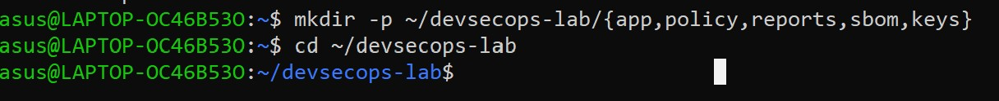
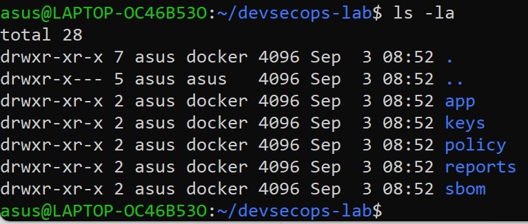

# LAPORAN PRAKTIKUM BAB 1

## Fondasi Teoretis dan Kerangka Kerja DevSecOps

**Nama**: Fitria Sari Ayuningtyas  
**NIM**: 3126640013  
**Kelas**: D4 LJ Teknik Informatika  
**Tanggal pelaksanaan**: 15 September 2026

## 1. Tujuan Praktikum

Praktikum Bab 1 bertujuan untuk menetapkan baseline laboratorium DevSecOps dan melakukan verifikasi awal terhadap lingkungan yang digunakan sebelum melaksanakan eksperimen berikutnya.

## 2. Dasar Teori Singkat

DevSecOps merupakan pendekatan yang mengintegrasikan keamanan ke dalam seluruh proses pengembangan dan delivery perangkat lunak. Keamanan tidak hanya dilakukan pada tahap akhir, tetapi mulai diperhatikan sejak proses perencanaan, pengembangan, pengujian, deployment, hingga tahap operasi.

Salah satu prinsip dalam DevSecOps adalah *shift-left*, yaitu melakukan pemeriksaan keamanan sedini mungkin dalam proses pengembangan. Selain itu, terdapat *shift-right* yang berfokus pada pemantauan dan pemeriksaan keamanan setelah aplikasi dijalankan. Kedua pendekatan tersebut saling melengkapi untuk membantu menemukan dan menangani risiko keamanan.

Baseline diperlukan untuk mengetahui kondisi awal lingkungan praktikum, seperti versi perangkat yang digunakan, konfigurasi, struktur direktori, dan mekanisme keamanan yang tersedia. Dengan adanya baseline, hasil eksperimen dapat dicatat dan dibandingkan apabila terjadi perubahan pada lingkungan praktikum.

## 3. Alat dan Lingkungan

| Komponen | Hasil Identifikasi |
|---|---|
| Operating System | Ubuntu pada WSL 2 |
| Pengguna eksekusi | `asus` |
| Direktori kerja | `~/devsecops-lab` |
| Git | 2.53.0 |
| OpenSSL | 3.5.5 |
| cURL | 8.18.0 |
| Docker Engine | 29.7.2 |
| Docker Compose | 5.5.0 |
| Docker Security Options | `seccomp (builtin)`, `cgroupns` |

## 4. Langkah Praktikum

### 4.1 Membuat Struktur Direktori

Pada tahap pertama dilakukan pembuatan struktur direktori kerja untuk laboratorium DevSecOps. Direktori utama yang digunakan adalah `devsecops-lab` dengan beberapa subdirektori, yaitu `app`, `policy`, `reports`, `sbom`, dan `keys`.

Perintah yang digunakan:

```bash
mkdir -p ~/devsecops-lab/{app,policy,reports,sbom,keys}
cd ~/devsecops-lab
```

Setelah perintah dijalankan, direktori kerja berhasil dibuat dan proses praktikum dilanjutkan dari direktori `~/devsecops-lab`.

### 4.2 Mencatat Versi Perangkat

Tahap berikutnya dilakukan pemeriksaan versi perangkat yang digunakan dalam praktikum. Pemeriksaan ini bertujuan untuk mencatat kondisi awal lingkungan sehingga dapat diketahui versi perangkat yang digunakan selama praktikum.

Perintah yang digunakan:

```bash
docker version
docker compose version
git --version
openssl version
curl --version
docker info --format '{{json .SecurityOptions}}'
```

Dari pemeriksaan tersebut diperoleh versi Docker, Docker Compose, Git, OpenSSL, dan cURL. Selain itu, dilakukan pemeriksaan terhadap Security Options pada Docker untuk mengetahui mekanisme keamanan yang tersedia pada lingkungan Docker.

### 4.3 Verifikasi Direktori dan Permission

Tahap terakhir dilakukan verifikasi terhadap direktori `reports`, `sbom`, dan `keys`. Pemeriksaan dilakukan untuk memastikan direktori tersebut telah tersedia serta mengetahui permission dan kepemilikannya.

Perintah yang digunakan:

```bash
ls -ld reports sbom keys
```

## 5. Hasil Pengujian

### 5.1 Hasil Perintah Utama

Berdasarkan perintah yang telah dijalankan, struktur direktori dan perangkat yang digunakan pada lingkungan praktikum berhasil diperiksa. Hasil pemeriksaan yang diperoleh adalah sebagai berikut.

| Pemeriksaan             | Hasil                                                                    |
| ----------------------- | ------------------------------------------------------------------------ |
| Struktur direktori      | Direktori `app`, `policy`, `reports`, `sbom`, dan `keys` berhasil dibuat |
| Docker Engine           | 29.7.2                                                                   |
| Docker Compose          | v5.5.0                                                                   |
| Git                     | 2.53.0                                                                   |
| OpenSSL                 | 3.5.5                                                                    |
| cURL                    | 8.18.0                                                                   |
| Docker Security Options | `seccomp (builtin)` dan `cgroupns`                                       |
| Permission `reports`    | `drwxr-xr-x`                                                             |
| Permission `sbom`       | `drwxr-xr-x`                                                             |
| Permission `keys`       | `drwxr-xr-x`                                                             |

Dari hasil tersebut dapat diketahui bahwa seluruh perangkat utama yang diperlukan untuk praktikum telah tersedia dan dapat digunakan. Struktur direktori yang dibutuhkan juga berhasil dibuat.

### 5.2 Bukti Output

Berikut merupakan bukti hasil pemeriksaan yang dilakukan pada lingkungan praktikum.

**Gambar 1. Struktur Direktori Laboratorium DevSecOps**

> 
>  

Screenshot menunjukkan bahwa direktori `devsecops-lab` telah memiliki subdirektori `app`, `policy`, `reports`, `sbom`, dan `keys`.

**Gambar 2. Hasil Pemeriksaan Versi Perangkat**

> `[MASUKKAN SCREENSHOT VERSI DOCKER, DOCKER COMPOSE, GIT, OPENSSL, DAN CURL DI SINI]`

Screenshot menunjukkan versi perangkat yang digunakan pada lingkungan praktikum.

**Gambar 3. Hasil Pemeriksaan Security Options Docker**

> `[MASUKKAN SCREENSHOT SECURITY OPTIONS DI SINI]`

Hasil pemeriksaan menunjukkan adanya mekanisme `seccomp` dengan profil bawaan dan `cgroupns` pada lingkungan Docker.

**Gambar 4. Hasil Verifikasi Permission Direktori**

> `[MASUKKAN SCREENSHOT PERMISSION REPORTS, SBOM, DAN KEYS DI SINI]`

Screenshot menunjukkan bahwa direktori `reports`, `sbom`, dan `keys` tersedia dengan permission `drwxr-xr-x` serta dimiliki oleh pengguna `asus` dan group `docker`.


Hasil pemeriksaan menunjukkan bahwa ketiga direktori tersebut telah tersedia dengan permission `drwxr-xr-x` dan dimiliki oleh pengguna `asus` dengan group `docker`.

Pemeriksaan ini digunakan untuk mengetahui kondisi permission pada direktori. Konfigurasi web server tidak diperiksa pada praktikum ini, sehingga status direktori tersebut sebagai web root belum dapat diverifikasi.
