# LAPORAN PRAKTIKUM BAB 3

## Docker Network, Volume, Bind Mount, tmpfs, dan Docker Compose

**Nama**: Fitria Sari Ayuningtyas  
**NIM**: 3126640013  
**Kelas**: B D4 LJ Teknik Informatika  
**Tanggal pelaksanaan**: 23 September 2026

## 1. Tujuan Praktikum

Praktikum Bab 3 bertujuan memahami komunikasi antar-container menggunakan user-defined bridge network serta memahami penggunaan named volume, bind mount, dan tmpfs sebagai mekanisme penyimpanan data pada container.

Praktikum ini juga bertujuan menerapkan Docker Compose untuk menjalankan aplikasi multi-container yang terdiri dari Nginx, Flask, dan PostgreSQL. Selain itu, praktikum melatih proses verifikasi, troubleshooting, serta identifikasi risiko keamanan dan operasional pada lingkungan container.

## 2. Dasar Teori Singkat

Docker network digunakan untuk mengatur komunikasi antar-container. User-defined bridge memungkinkan container dalam network yang sama saling berkomunikasi menggunakan nama container dan memberikan konfigurasi network yang lebih terkontrol.

Docker menyediakan beberapa mekanisme penyimpanan data. Named volume dikelola oleh Docker dan dapat mempertahankan data meskipun container dihapus. Bind mount memetakan direktori pada host secara langsung ke dalam container sehingga perubahan file pada host dapat langsung digunakan oleh container. Sementara itu, tmpfs menyimpan data secara sementara di memory dan data tersebut tidak dipertahankan setelah container di-restart.

Docker Compose digunakan untuk mendefinisikan dan menjalankan beberapa service dalam satu konfigurasi. Pada praktikum ini, Docker Compose digunakan untuk menjalankan Nginx sebagai web server dan reverse proxy, Flask sebagai backend, serta PostgreSQL sebagai database. Konfigurasi juga menggunakan network frontend dan backend serta healthcheck untuk memastikan PostgreSQL siap menerima koneksi sebelum service Flask digunakan.

## 3. Alat dan Lingkungan

| **Komponen**             | **Hasil identifikasi**            |
| ------------------------ | --------------------------------- |
| Operating system         | Ubuntu pada WSL2                  |
| Docker Engine            | 29.7.2                            |
| Docker Compose           | v5.5.0                            |
| Web Server               | Nginx Alpine                      |
| Backend                  | Flask 3.1.2                       |
| Application Server       | Gunicorn 23.0.0                   |
| Database                 | PostgreSQL 16 Alpine              |
| Direktori kerja          | `~/docker-lab/bab-3/`             |
| Direktori Docker Compose | `~/docker-lab/bab-3/compose-lab/` |

Praktikum dijalankan pada lingkungan Ubuntu melalui WSL2. Docker Engine dan Docker Compose digunakan untuk menjalankan container secara lokal. Aplikasi multi-container terdiri dari Nginx, Flask, dan PostgreSQL.

## 4. Langkah Praktikum

### 4.1 User-defined Bridge Network

Perintah yang digunakan untuk membuat user-defined bridge network dan menjalankan dua container pada network yang sama:

```bash
mkdir -p ~/docker-lab/bab-3
cd ~/docker-lab/bab-3

docker network create --driver bridge --subnet 172.20.0.0/16 lab-net

docker run -d --name server-a --network lab-net nginx:alpine
docker run -d --name server-b --network lab-net nginx:alpine
```

Pengujian komunikasi antar-container dilakukan dengan:

```bash
docker exec server-a ping -c 3 server-b
```

Pemeriksaan konfigurasi network dilakukan menggunakan:

```bash
docker network inspect lab-net
```

**Bukti pengujian:**

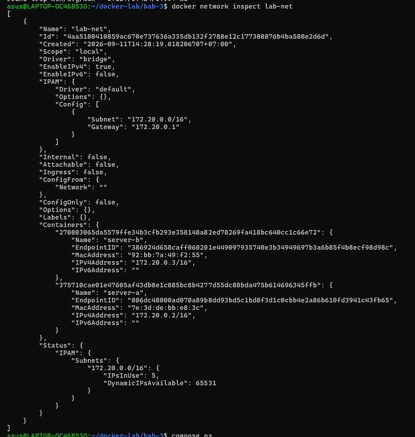

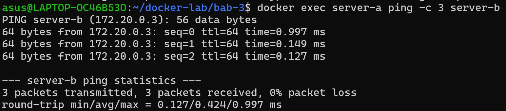
Hasil pengujian menunjukkan bahwa `server-a` berhasil berkomunikasi dengan `server-b` menggunakan nama container. Network `lab-net` menggunakan driver `bridge` dengan subnet `172.20.0.0/16`. Pengujian `ping` menghasilkan 3 paket diterima dari 3 paket yang dikirim dengan `0% packet loss`.

### 4.2 Named Volume

Named volume digunakan untuk menyimpan data secara terpisah dari lifecycle container. Pada pengujian ini, volume `data-vol` digunakan untuk menyimpan file `log.txt` yang dibuat oleh container `writer`.

Perintah yang digunakan:

```bash
docker volume create data-vol

docker run -d --name writer \
  -v data-vol:/app/data \
  alpine:3.20 \
  sh -c "while true; do date >> /app/data/log.txt; sleep 5; done"
```

Setelah beberapa saat, container `writer` dihapus untuk menguji apakah data pada volume tetap tersedia:

```bash
sleep 15
docker rm -f writer

docker run --rm \
  -v data-vol:/data \
  alpine:3.20 \
  cat /data/log.txt
```

Backup isi named volume dilakukan dengan:

```bash
docker run --rm \
  -v data-vol:/source:ro \
  -v $(pwd):/backup \
  alpine:3.20 \
  tar czf /backup/data-vol-backup.tar.gz -C /source .

ls -lh data-vol-backup.tar.gz
```

**Bukti pengujian:**

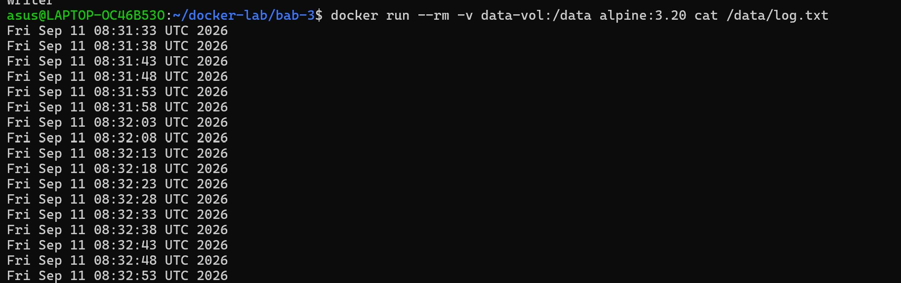

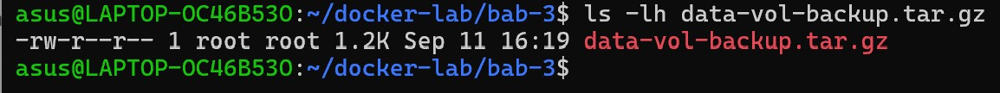

Hasil pengujian menunjukkan bahwa file `log.txt` masih dapat dibaca setelah container `writer` dihapus. File `data-vol-backup.tar.gz` juga berhasil dibuat sebagai hasil backup isi volume. Hal ini menunjukkan bahwa named volume dapat mempertahankan data meskipun container yang menggunakannya telah dihapus.

### 4.3 Bind Mount

Bind mount digunakan untuk memetakan direktori pada host secara langsung ke dalam container. Pada pengujian ini, direktori `bind-test` pada host dipetakan ke direktori `/usr/share/nginx/html` di dalam container Nginx menggunakan mode read-only.

Perintah yang digunakan:

```bash
echo "Hello from host!" > bind-test/index.html

docker run -d --name bind-test-nginx \
  -v $(pwd)/bind-test:/usr/share/nginx/html:ro \
  nginx:alpine
```

Isi file kemudian diperiksa dari dalam container:

```bash
docker exec bind-test-nginx cat /usr/share/nginx/html/index.html
```

Selanjutnya, file pada host diubah:

```bash
echo "Hello after host change!" > bind-test/index.html
```

Perubahan diperiksa kembali dari dalam container:

```bash
docker exec bind-test-nginx cat /usr/share/nginx/html/index.html
```

**Bukti pengujian:**

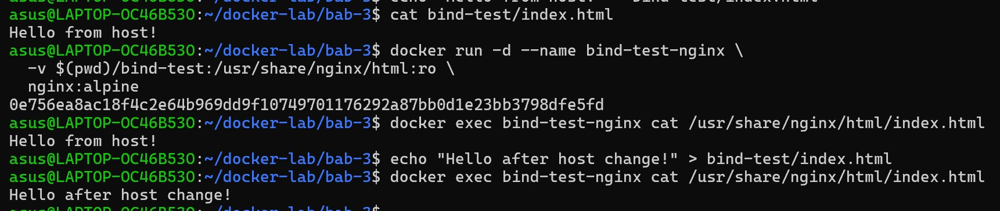

Hasil pengujian menunjukkan bahwa file `index.html` pada host dapat dibaca dari dalam container. Setelah isi file pada host diubah menjadi `Hello after host change!`, perubahan tersebut dapat langsung dibaca dari dalam container tanpa melakukan rebuild atau restart container. Hal ini menunjukkan bahwa bind mount memungkinkan container menggunakan file yang dikelola langsung dari host.

### 4.4 tmpfs

tmpfs digunakan untuk menyimpan data sementara pada container. Pada pengujian ini, direktori `/app/tmp` dipasang sebagai tmpfs dan digunakan untuk membuat file sementara.

Perintah yang digunakan:

```bash id="w8qv3x"
docker run -d --name tmpfs-restart \
  --tmpfs /app/tmp \
  alpine:3.20 \
  sleep 300
```

File sementara dibuat dan diperiksa sebelum container di-restart:

```bash id="9vl2dr"
docker exec tmpfs-restart sh -c \
  "echo 'data sementara' > /app/tmp/test.txt"

docker exec tmpfs-restart cat /app/tmp/test.txt
```

Container kemudian di-restart:

```bash id="2xq9kb"
docker restart tmpfs-restart
```

Setelah restart, isi direktori tmpfs diperiksa kembali:

```bash id="q5j0nt"
docker exec tmpfs-restart ls -la /app/tmp
```

**Bukti pengujian:**

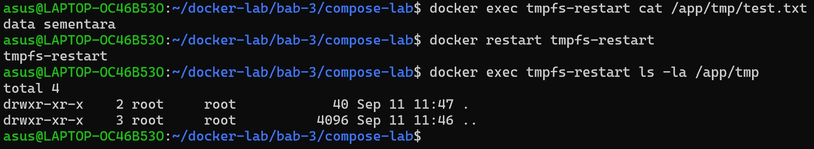

Hasil pengujian menunjukkan bahwa file `test.txt` dapat dibaca sebelum container di-restart. Setelah restart, file tersebut tidak ditemukan pada direktori `/app/tmp`. Hal ini menunjukkan bahwa data pada tmpfs bersifat sementara dan tidak dipertahankan setelah container di-restart.

### 4.5 Docker Compose

Docker Compose digunakan untuk menjalankan beberapa service dalam satu konfigurasi. Pada praktikum ini digunakan tiga service, yaitu Nginx sebagai web server dan reverse proxy, Flask sebagai backend, serta PostgreSQL sebagai database.

Konfigurasi Docker Compose menggunakan dua network, yaitu `frontend` dan `backend`. Service `web` terhubung ke network `frontend`, service `app` terhubung ke `frontend` dan `backend`, sedangkan service `db` hanya terhubung ke `backend`. PostgreSQL juga dilengkapi dengan healthcheck untuk memastikan database siap menerima koneksi sebelum service Flask dijalankan.

Perintah untuk memeriksa konfigurasi Docker Compose:

```bash
cd ~/docker-lab/bab-3/compose-lab

docker compose config
docker compose config --services
```

Selanjutnya seluruh service dijalankan dengan proses build:

```bash
docker compose up -d --build
```

Status service diperiksa menggunakan:

```bash
docker compose ps
```

**Bukti pengujian:**

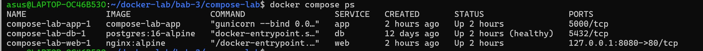


Hasil pengujian menunjukkan bahwa service `web`, `app`, dan `db` berhasil dijalankan. PostgreSQL berstatus `healthy`, sedangkan Nginx dapat diakses melalui port `8080`. Hal ini menunjukkan bahwa seluruh service dalam Docker Compose berhasil dijalankan sesuai konfigurasi.

Pengujian koneksi antar-service dilakukan dengan mengakses endpoint utama melalui Nginx:

curl http://localhost:8080/

Bukti pengujian:

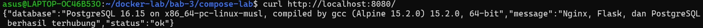

Hasil pengujian menunjukkan bahwa Nginx berhasil meneruskan request ke Flask dan Flask berhasil terhubung dengan PostgreSQL. Endpoint mengembalikan status ok, sehingga komunikasi antar-service berjalan dengan baik.

### 4.6 Health Check

Pengujian health check dilakukan untuk memastikan aplikasi dapat merespons request dengan baik melalui endpoint `/health`.

Perintah yang digunakan:

```bash
curl -i http://localhost:8080/health
```

**Bukti pengujian:**

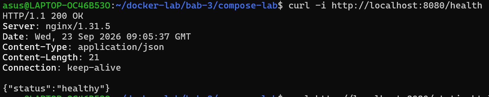

Hasil pengujian menunjukkan bahwa endpoint `/health` mengembalikan HTTP status `200 OK` dengan response `{"status":"healthy"}`. Hal ini menunjukkan bahwa aplikasi dapat merespons request dengan baik.

### 4.7 Pengujian Halaman Statis Nginx

Pengujian halaman statis dilakukan untuk memastikan Nginx dapat menyajikan file HTML yang dipasang melalui bind mount.

Halaman statis diakses melalui browser menggunakan alamat:

```text
http://localhost:8080/static.html
```

**Bukti pengujian:**

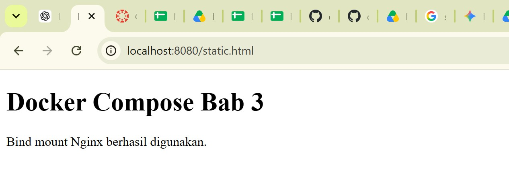

Hasil pengujian menunjukkan bahwa halaman `static.html` berhasil ditampilkan melalui Nginx. Hal ini menunjukkan bahwa bind mount pada service `web` dapat digunakan untuk menyajikan file statis dari host melalui Nginx.

### 4.8 Pengujian Log Docker Compose

Pengujian log dilakukan untuk memeriksa aktivitas dan status service yang berjalan pada Docker Compose. Log digunakan untuk melihat apakah Nginx, Flask, dan PostgreSQL berhasil berjalan serta untuk membantu menemukan masalah yang terjadi selama pengujian.

Perintah yang digunakan:

```bash id="4b9n3v"
docker compose logs --tail 50
```

**Bukti pengujian:**

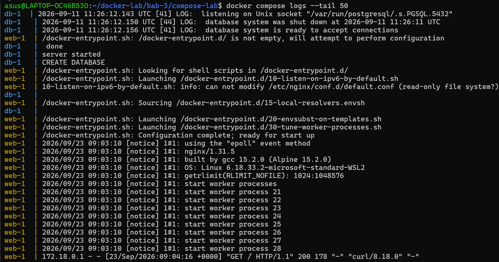

Hasil pengujian menunjukkan bahwa PostgreSQL berhasil berjalan dan siap menerima koneksi, Gunicorn berhasil menjalankan aplikasi Flask, serta Nginx berhasil melayani request. Pada log juga terlihat request halaman `/` dan `/health` berhasil dengan status `200`. Terdapat request `/static.html` yang sempat menghasilkan `404`, kemudian berhasil menghasilkan `200` setelah file statis tersedia.

## 5. Hasil Pengujian

### 5.1 Hasil Perintah Utama

Hasil pengujian utama pada praktikum ini meliputi pengujian komunikasi antar-container, persistence data, bind mount, tmpfs, serta komunikasi antar-service pada Docker Compose.

| **Pengujian**       | **Hasil**                                                                                               |
| ------------------- | ------------------------------------------------------------------------------------------------------- |
| User-defined bridge | `server-a` berhasil berkomunikasi dengan `server-b` menggunakan nama container dengan `0% packet loss`. |
| Named volume        | Data `log.txt` tetap tersedia setelah container `writer` dihapus.                                       |
| Bind mount          | Perubahan file pada host dapat langsung dibaca dari dalam container.                                    |
| tmpfs               | File sementara tidak tersedia setelah container di-restart.                                             |
| Docker Compose      | Service `web`, `app`, dan `db` berhasil berjalan, dengan PostgreSQL berstatus `healthy`.                |
| Endpoint utama      | Nginx, Flask, dan PostgreSQL berhasil terhubung dan endpoint mengembalikan status `ok`.                 |
| Health check        | Endpoint `/health` mengembalikan `HTTP 200 OK` dengan status `healthy`.                                 |
| Halaman statis      | Nginx berhasil menampilkan halaman `static.html`.                                                       |
| Log                 | Log menunjukkan service berjalan dan request berhasil dilayani.                                         |

### 5.2 Bukti Output

Bukti output praktikum ditunjukkan melalui screenshot hasil pengujian pada setiap tahapan. Dokumentasi pengujian meliputi network, volume, bind mount, tmpfs, Docker Compose, endpoint aplikasi, health check, halaman statis, dan log service.

| **Gambar** | **Bukti Pengujian**                                        |
| ---------- | ---------------------------------------------------------- |
| Gambar 1   | User-defined bridge network dan komunikasi antar-container |
| Gambar 2   | Persistence dan backup named volume                        |
| Gambar 3   | Pengujian bind mount                                       |
| Gambar 4   | Pengujian tmpfs sebelum dan setelah restart                |
| Gambar 5   | Status service Docker Compose                              |
| Gambar 6   | Koneksi Nginx, Flask, dan PostgreSQL                       |
| Gambar 7   | Health check aplikasi                                      |
| Gambar 8   | Halaman statis melalui Nginx                               |
| Gambar 9   | Log Docker Compose                                         |

Seluruh bukti pengujian menunjukkan bahwa konfigurasi container dan service dapat berjalan sesuai dengan rancangan yang telah dibuat. Dokumentasi juga digunakan sebagai dasar untuk melakukan analisis terhadap hasil pengujian dan masalah yang ditemukan selama praktikum.

## 6. Threat Statement

Pada lingkungan container yang digunakan dalam praktikum ini terdapat beberapa aset yang perlu dilindungi, yaitu data pada named volume, file pada bind mount, service aplikasi Flask, konfigurasi Nginx, serta database PostgreSQL.

Potensi ancaman dapat berasal dari kesalahan konfigurasi container, akses berlebihan terhadap file host melalui bind mount, serta pengelolaan kredensial database yang tidak aman. Bind mount dengan akses tulis dan direktori yang terlalu luas dapat memungkinkan perubahan terhadap file pada host apabila container mengalami kompromi.

Selain itu, kredensial database yang dituliskan secara langsung pada file konfigurasi Docker Compose dapat meningkatkan risiko kebocoran apabila file konfigurasi tersebut diakses oleh pihak yang tidak berwenang.

Dampak yang mungkin terjadi meliputi perubahan atau kehilangan data, gangguan terhadap service, serta terbukanya informasi sensitif. Oleh karena itu, konfigurasi container perlu menggunakan prinsip least privilege, membatasi akses bind mount, menggunakan mount read-only jika memungkinkan, dan menerapkan pengelolaan secret yang lebih aman untuk lingkungan produksi.

## 7. Analisis

Hasil praktikum menunjukkan bahwa user-defined bridge network dapat digunakan untuk menghubungkan container dan memungkinkan komunikasi menggunakan nama container. Pengujian `ping` dari `server-a` ke `server-b` berhasil dengan `0% packet loss`, sehingga komunikasi pada network `lab-net` berjalan dengan baik.

Pada pengujian named volume, data `log.txt` tetap dapat dibaca setelah container `writer` dihapus. Hal ini menunjukkan bahwa lifecycle data pada named volume terpisah dari lifecycle container. Backup volume juga berhasil dibuat dalam bentuk file `data-vol-backup.tar.gz`.

Pada pengujian bind mount, perubahan file pada host dapat langsung terlihat dari dalam container. Sementara itu, pengujian tmpfs menunjukkan bahwa file sementara tidak tersedia setelah container di-restart. Hasil tersebut sesuai dengan karakteristik masing-masing mekanisme penyimpanan.

Pada Docker Compose, service `web`, `app`, dan `db` berhasil berjalan. PostgreSQL menunjukkan status `healthy`, sedangkan endpoint utama berhasil mengembalikan informasi bahwa Nginx, Flask, dan PostgreSQL telah terhubung. Endpoint `/health` juga mengembalikan status `200 OK` dengan response `{"status":"healthy"}`.

### 7.1 Masalah dan Diagnosis

Pada pengujian awal halaman statis, akses ke:

```text
http://localhost:8080/static.html
```

menghasilkan response `404 Not Found`. Pemeriksaan terhadap direktori `html` menunjukkan bahwa file `static.html` belum tersedia dan hanya terdapat file `index.html`.

Masalah tersebut diperbaiki dengan membuat salinan file `index.html` menjadi `static.html`:

```bash
cp html/index.html html/static.html
```

Setelah file tersedia, pengujian ulang terhadap `/static.html` berhasil dan halaman dapat ditampilkan melalui browser. Log Docker Compose juga menunjukkan bahwa request `/static.html` yang sebelumnya menghasilkan `404` kemudian berhasil menghasilkan status `200`.

Hal ini menunjukkan bahwa pemeriksaan log dan pengecekan file pada host dapat digunakan untuk membantu menemukan dan memperbaiki masalah konfigurasi atau file pada lingkungan Docker Compose.

## 8. Tindak Lanjut

Berdasarkan hasil pengujian dan analisis, beberapa tindak lanjut yang dapat dilakukan untuk meningkatkan keamanan dan keandalan lingkungan container adalah sebagai berikut:

1. **Membatasi bind mount**
   Direktori yang dipasang melalui bind mount sebaiknya dibatasi hanya pada file atau folder yang diperlukan. Penggunaan mode read-only seperti `:ro` dapat diterapkan jika container tidak perlu melakukan perubahan terhadap file host.

2. **Mengamankan kredensial database**
   Kredensial PostgreSQL yang saat ini dituliskan secara langsung pada file Docker Compose sebaiknya dipindahkan ke mekanisme pengelolaan secret atau secret manager pada lingkungan produksi.

3. **Melakukan backup secara berkala**
   Data pada named volume perlu dicadangkan secara berkala. Backup juga perlu disimpan pada lokasi terpisah dan proses restore perlu diuji secara berkala untuk memastikan backup dapat digunakan ketika terjadi kehilangan data.

4. **Menggunakan image dengan versi yang terkontrol**
   Image container sebaiknya menggunakan versi yang jelas dan diperbarui secara berkala. Untuk lingkungan produksi, penggunaan image berdasarkan digest dapat dipertimbangkan agar image yang digunakan lebih konsisten.

5. **Mempertahankan prinsip least privilege**
   Container dan service sebaiknya hanya diberikan akses yang diperlukan. Penggunaan user non-root pada aplikasi Flask seperti `appuser` dapat dipertahankan untuk mengurangi hak akses yang tidak diperlukan.

## 9. Kesimpulan

Praktikum Bab 3 telah berhasil menerapkan dan menguji penggunaan Docker network, named volume, bind mount, tmpfs, serta Docker Compose. User-defined bridge berhasil digunakan untuk melakukan komunikasi antar-container menggunakan nama container.

Pengujian penyimpanan menunjukkan bahwa named volume dapat mempertahankan data setelah container dihapus, bind mount dapat meneruskan perubahan file dari host ke container, sedangkan tmpfs menyimpan data secara sementara dan tidak mempertahankannya setelah container di-restart.

Docker Compose berhasil digunakan untuk menjalankan service Nginx, Flask, dan PostgreSQL dengan pemisahan network frontend dan backend. Pengujian endpoint utama, health check, halaman statis, dan log menunjukkan bahwa service dapat berkomunikasi dan berjalan sesuai konfigurasi. Proses troubleshooting terhadap halaman `static.html` juga berhasil dilakukan berdasarkan hasil pengujian dan pemeriksaan log.

Dari praktikum ini dapat dipahami bahwa pemilihan network, mekanisme penyimpanan, konfigurasi service, serta penerapan keamanan dan backup perlu disesuaikan dengan kebutuhan aplikasi agar lingkungan container dapat berjalan secara terkontrol dan dapat dipelihara dengan baik.

## 10. Referensi

1. Docker. *Docker Documentation: Get Started*.
   https://docs.docker.com/get-started/

2. Docker. *Docker Networking Overview*.
   https://docs.docker.com/engine/network/

3. Docker. *Volumes*.
   https://docs.docker.com/engine/storage/volumes/

4. Docker. *Bind mounts*.
   https://docs.docker.com/engine/storage/bind-mounts/

5. Docker. *tmpfs mounts*.
   https://docs.docker.com/engine/storage/tmpfs/

6. Docker. *Docker Compose Documentation*.
   https://docs.docker.com/compose/

7. Docker. *Compose file reference*.
   https://docs.docker.com/reference/compose-file/

8. Docker. *Docker security*.
   https://docs.docker.com/engine/security/

9. Nginx. *Nginx Documentation*.
   https://nginx.org/en/docs/

10. PostgreSQL Global Development Group. *PostgreSQL Documentation*.
    https://www.postgresql.org/docs/


